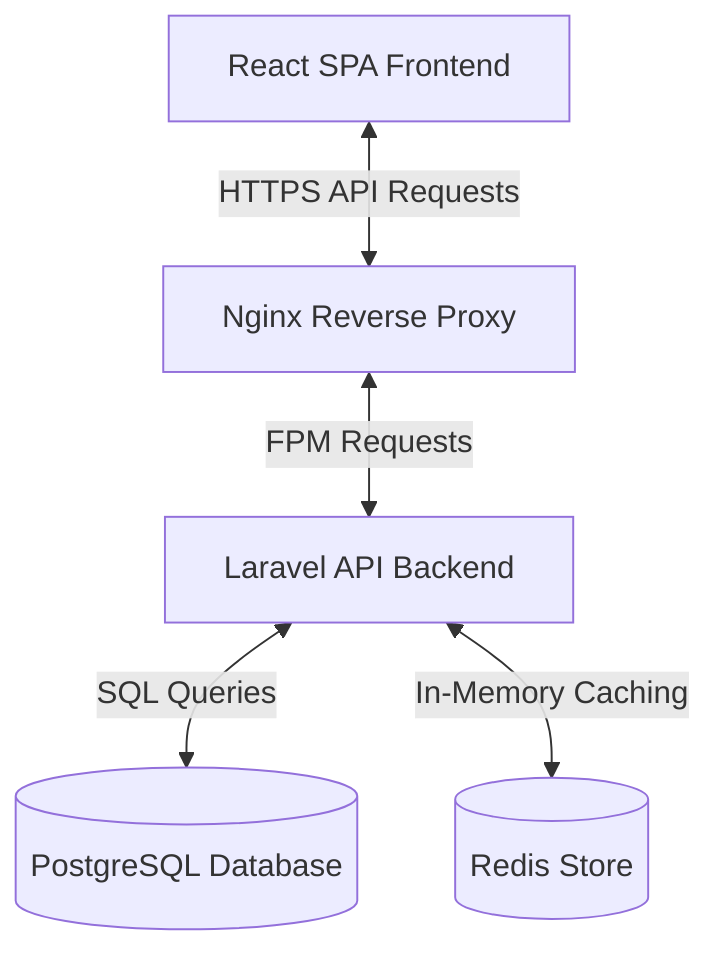

# Architecture, Security, and Scalability Decisions

This document provides a comprehensive overview of the design, architectural paradigms, security controls, scalability strategies, and User Experience (UX) choices implemented for the Appifylab Social Platform.

---

## 1. System Architecture Overview

The application is built using a decoupled **Single Page Application (SPA)** and **RESTful API** architecture:

* **Frontend**: Built with React (CRA), utilizing modern hooks (`useRef`, `useState`, `useEffect`) and native Web API interfaces (`IntersectionObserver`) for dynamic page interaction.
* **Backend**: Powered by Laravel 13 (PHP 8.4) organized using the **Repository Pattern** and **Data Transfer Objects (DTOs)**. This separates business logic from raw database query details and enforces strict data structure interfaces.
* **Deployments**: CI/CD automated via **GitHub Actions workflows**. Code modifications undergo automatic syntax validation and unit testing before automated deployment.

---

## 2. High-Scale Performance & Scalability (Millions of Posts/Reads)

To support platforms with millions of records and high concurrent reads, we moved away from classic offset-based databases and query patterns:

### 1. Cursor-Based Pagination
* **The Problem**: Traditional offset-based pagination (`LIMIT 20 OFFSET 100000`) becomes progressively slower as the offset increases, because the database must scan and sort all preceding `100,000` rows.
* **The Solution**: Implemented **Cursor-Based Pagination** using Laravel's native `cursorPaginate()`. Paging queries use a cursor containing the absolute columns (like `created_at` and `id`) of the last loaded item.
* **Result**: Queries resolve in `O(log N)` index lookup complexity regardless of page depth, completely eliminating database page scanning bottlenecks.

### 2. Comprehensive Database Indexing
* **Foreign Key Indexing**: By default, relational databases like PostgreSQL do not automatically index foreign keys. We explicitly added indices on `user_id` and `parent_id` columns across the `posts` and `comments` tables to avoid slow sequential scans during cascade-deletes or joins.
* **Composite Query Optimization**: Added composite indices tailored to the application's feed queries:
  * `posts` index: `(visibility, created_at DESC)` – yields sub-millisecond retrieval speeds for the global public feed.
  * `posts` index: `(user_id, visibility, created_at DESC)` – handles user profile feeds viewed by other accounts.
  * `comments` index: `(post_id, parent_id, created_at ASC)` – maps the sequential replies timeline.

### 3. Denormalized Counter Cache
* **The Problem**: Running `COUNT(*)` queries to display the total number of reactions or comments on every post rendered in a feed introduces massive CPU overhead at scale.
* **The Solution**: Denormalized counter columns (`reactions_count`, `comments_count`, and `replies_count`) exist directly on the `posts` and `comments` tables. 
* **Result**: Counter updates occur atomically using transactional operations (`increment` / `decrement`) during create/delete actions, ensuring feed loading performs in `O(1)` time.

### 4. Advanced Caching Strategy (Redis)
* **Pre-cached Writes**: When a new post is created in `PostService`, it is eager-loaded with its author metadata (`loadMissing('user')`) and cached immediately.
* **Redundant Query Prevention**: Modified `PostController` to check for loaded relations using `loadMissing('user')` rather than forcing a reload. This completely eliminates redundant SQL database queries for posts retrieved from cache hits.

---

## 3. Security Architecture

Security is built directly into all API transactions and request scopes:

* **Token-Based Authentication**: Handled using **Laravel Sanctum**. Cryptographically signed hashes secure access tokens. Unique database constraints enforce fast, indexed lookups for verification.
* **Strict Validation Rules**: All incoming request payloads pass through dedicated validation filters verifying string boundaries, database existence, UUID structures, and file uploads.
* **Media Upload Protections**: Uploaded media (images/videos) validate strictly against allowed MIME types (e.g. `image/*`, `video/mp4`) and file size limits (Max 10MB for photos, Max 50MB for videos) to prevent server storage denial-of-service (DoS).
* **Visibility Scoping**: The API automatically appends a `visibility = 'public'` filter to feed queries, except when authenticated authors view their own profile, where private posts are safely fetched.
* **Rate Limiting**: Critical endpoints (such as `login` and `register`) enforce a throttle middleware limit (10 requests per minute) to defend against automated brute-force attacks.

---

## 4. User Experience (UX) Design Decisions

High-performing interfaces must feel fast and responsive to build user trust:

* **Seamless Infinite Scrolling**: Integrated native browser `IntersectionObserver` on the frontend feed rather than window scroll listeners. This avoids layout thrashing, minimizes CPU utilization, and automatically fetches subsequent feed pages before the user reaches the absolute bottom.
* **Double Submission Prevention**: The "Post", "Login", and "Register" buttons disable themselves and render loading spinners when an API transaction is in progress. This prevents duplicate data entries and API request congestion.
* **Input State Preservation**: Submit actions only clear input fields (like post text or uploaded files) after a successful `200/201` API response. If validation fails or a network issue occurs, the user's typed data remains intact, preventing frustrating loss of input.
* **Robust URL Fallbacks**: Configured conditional environment variables in the deployment pipelines, preventing empty variables from overriding `.env.production` settings and ensuring production assets fall back smoothly to secure `https` endpoints.
