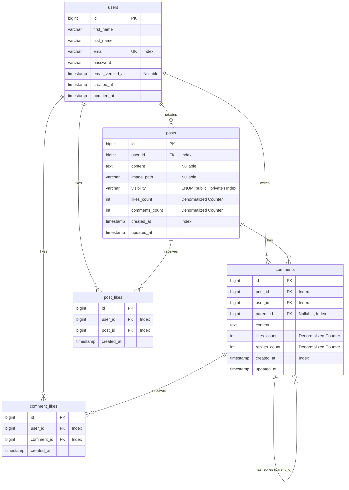

# Database Data Model and Entity Relationship Diagram (ERD)

This document outlines the proposed database design, Entity Relationship Diagram (ERD), indexing strategies, and architectural considerations to support a highly performant and secure social feed application scaling to millions of users, posts, and reads.

---

## 1. Entity Relationship Diagram (ERD)

Below is the database ERD modeled using Mermaid. It uses explicit relationships with native foreign keys for likes.



---

## 2. Table Schemas & Data Model

### `users` Table
Stores user registration details and credentials.

| Column | Type | Attributes | Description |
| :--- | :--- | :--- | :--- |
| `id` | `BIGINT UNSIGNED` | Primary Key, Auto Increment | Unique identifier. |
| `first_name` | `VARCHAR(255)` | Not Null | User's first name. |
| `last_name` | `VARCHAR(255)` | Not Null | User's last name. |
| `email` | `VARCHAR(255)` | Unique, Not Null | Email address (used for login). |
| `password` | `VARCHAR(255)` | Not Null | Hashed password (e.g., bcrypt/argon2). |
| `email_verified_at`| `TIMESTAMP` | Nullable | Email verification timestamp. |
| `created_at` | `TIMESTAMP` | Default CURRENT_TIMESTAMP| Record creation time. |
| `updated_at` | `TIMESTAMP` | Default CURRENT_TIMESTAMP| Record update time. |

* **Indexes**:
  * Primary Key on `id`
  * Unique Index on `email`

---

### `posts` Table
Stores the user-generated posts. Supports text and an optional single image.

| Column | Type | Attributes | Description |
| :--- | :--- | :--- | :--- |
| `id` | `BIGINT UNSIGNED` | Primary Key, Auto Increment | Unique identifier. |
| `user_id` | `BIGINT UNSIGNED` | Foreign Key (users.id), Not Null | Author of the post. |
| `content` | `TEXT` | Nullable | The text content of the post. |
| `image_path` | `VARCHAR(255)` | Nullable | URL/path to the uploaded image in storage (S3/local). |
| `visibility` | `VARCHAR(20)` | Default 'public', Not Null | `'public'` (visible to all) or `'private'` (author only). |
| `likes_count` | `INT` | Default 0, Not Null | Denormalized count of likes to avoid expensive COUNT reads. |
| `comments_count`| `INT` | Default 0, Not Null | Denormalized count of top-level comments + replies. |
| `created_at` | `TIMESTAMP` | Default CURRENT_TIMESTAMP| Feed ordering basis. |
| `updated_at` | `TIMESTAMP` | Default CURRENT_TIMESTAMP| Record update time. |

* **Indexes & Optimization**:
  * Primary Key on `id`
  * Index on `user_id` for user profile feeds.
  * Composite Index: `(visibility, created_at DESC)` for fetching the global public feed fast.

---

### `comments` Table
Stores comments and nested replies. Uses the **Adjacency List Pattern** with `parent_id`.

| Column | Type | Attributes | Description |
| :--- | :--- | :--- | :--- |
| `id` | `BIGINT UNSIGNED` | Primary Key, Auto Increment | Unique identifier. |
| `post_id` | `BIGINT UNSIGNED` | Foreign Key (posts.id), Not Null | The root post this comment/reply belongs to. |
| `user_id` | `BIGINT UNSIGNED` | Foreign Key (users.id), Not Null | The author of the comment/reply. |
| `parent_id` | `BIGINT UNSIGNED` | Foreign Key (comments.id), Nullable| Reference to parent comment if it is a reply. |
| `content` | `TEXT` | Not Null | The message text. |
| `likes_count` | `INT` | Default 0, Not Null | Denormalized likes counter. |
| `replies_count` | `INT` | Default 0, Not Null | Denormalized replies counter. |
| `created_at` | `TIMESTAMP` | Default CURRENT_TIMESTAMP| Ordering of comments/replies. |
| `updated_at` | `TIMESTAMP` | Default CURRENT_TIMESTAMP| Record update time. |

* **Key Design Decisions**:
  * **`post_id` is always populated**, even for deeply nested replies. This allows pulling or counting all comments for a post in a single flat query without recursion.
  * `parent_id` is `NULL` for top-level comments and contains the parent comment ID for replies.
* **Indexes**:
  * Primary Key on `id`
  * Composite Index: `(post_id, parent_id, created_at ASC)` to load comments and replies sequentially for a post.

---

### `post_likes` Table
Stores user likes for posts.

| Column | Type | Attributes | Description |
| :--- | :--- | :--- | :--- |
| `id` | `BIGINT UNSIGNED` | Primary Key, Auto Increment | Unique identifier. |
| `user_id` | `BIGINT UNSIGNED` | Foreign Key (users.id), Not Null | User who liked the post. |
| `post_id` | `BIGINT UNSIGNED` | Foreign Key (posts.id), Not Null | Post that was liked. |
| `created_at` | `TIMESTAMP` | Default CURRENT_TIMESTAMP| Timestamp of the action. |

* **Indexes & Optimization**:
  * Composite Unique Index: `(user_id, post_id)` - Ensures a user can only like a post once and allows checking "has liked" status in `O(1)`.
  * Composite Lookup Index: `(post_id, created_at DESC)` - Used to display the list of users who liked the post.

---

### `comment_likes` Table
Stores user likes for comments and replies.

| Column | Type | Attributes | Description |
| :--- | :--- | :--- | :--- |
| `id` | `BIGINT UNSIGNED` | Primary Key, Auto Increment | Unique identifier. |
| `user_id` | `BIGINT UNSIGNED` | Foreign Key (users.id), Not Null | User who liked the comment. |
| `comment_id` | `BIGINT UNSIGNED` | Foreign Key (comments.id), Not Null | Comment or reply that was liked. |
| `created_at` | `TIMESTAMP` | Default CURRENT_TIMESTAMP| Timestamp of the action. |

* **Indexes & Optimization**:
  * Composite Unique Index: `(user_id, comment_id)` - Ensures a user can only like a comment/reply once and allows checking "has liked" status in `O(1)`.
  * Composite Lookup Index: `(comment_id, created_at DESC)` - Used to display the list of users who liked the comment/reply.

---

## 3. High-Scale Optimization Strategies

Designing for **millions of posts and reads** requires shifting from purely normalized database queries to optimization, denormalization, and caching strategies.

### 1. Counter Denormalization
* **The Problem**: Executing `SELECT COUNT(*) FROM post_likes WHERE post_id = ?` on every feed render will lock and slow down the database at scale.
* **The Solution**: Maintain `likes_count` and `comments_count` directly in the `posts` and `comments` tables. 
* **Implementation**: Increment/decrement these values using transactional atomic queries (e.g., `DB::raw('likes_count + 1')`) whenever a like is added/removed.

### 2. Composite Query Indexing
* **Feed Retrieval**: The primary query fetches the latest public posts:
  ```sql
  SELECT * FROM posts 
  WHERE visibility = 'public' 
  ORDER BY created_at DESC 
  LIMIT 20;
  ```
  An index on `(visibility, created_at DESC)` allows the engine to fetch the latest 20 posts in `O(log N)` without scanning millions of rows or executing a costly filesort.

### 3. Quick "Has Liked" Check
* When rendering a feed page of 20 posts, we must show whether the current user liked each post.
* **The Optimization**: Instead of running 20 individual queries, fetch all liked post IDs for the current user in a single batch query:
  ```sql
  SELECT post_id FROM post_likes 
  WHERE user_id = :current_user_id 
    AND post_id IN (:post_ids);
  ```
  This is backed by the composite unique index `(user_id, post_id)` and returns instantly.

### 4. Fetching the List of Liked/Reacted Users
* **The Requirement**: Users want to see a list of who has liked a specific post or comment (ordered by the most recent reaction).
* **The Queries**:
  * **For a Post**:
    ```sql
    SELECT u.id, u.first_name, u.last_name, u.email 
    FROM post_likes pl
    JOIN users u ON pl.user_id = u.id
    WHERE pl.post_id = :post_id
    ORDER BY pl.created_at DESC
    LIMIT 20 OFFSET :offset;
    ```
  * **For a Comment**:
    ```sql
    SELECT u.id, u.first_name, u.last_name, u.email 
    FROM comment_likes cl
    JOIN users u ON cl.user_id = u.id
    WHERE cl.comment_id = :comment_id
    ORDER BY cl.created_at DESC
    LIMIT 20 OFFSET :offset;
    ```
* **The Optimization**: These queries use the composite lookup indexes `(post_id, created_at DESC)` and `(comment_id, created_at DESC)` on the likes tables. The database engine can locate the exact rows directly, join them with the primary key index on the `users` table (`O(1)` per user), and paginate the results without performing any full-table scans.

### 5. Read Replicas & Database Sharding
* **Primary/Replica Setup**: Reads typically outnumber writes in social feeds by 10:1 or 100:1. Setup read replicas to distribute reading workloads.
* **Sharding (conceptual future-proofing)**: If the dataset grows to hundreds of millions, shard the tables horizontally by hash of user IDs or post IDs, ensuring related data is colocated on specific nodes.

### 6. Caching Layer (Redis)
* **Feed Cache**: Cache the global public feed (e.g., first 50-100 posts) in Redis. Active reads fetch directly from memory.
* **User Session Cache**: Authenticated user session state (or JWT validation cache) can be stored in Redis to minimize hitting the database during token verification.
