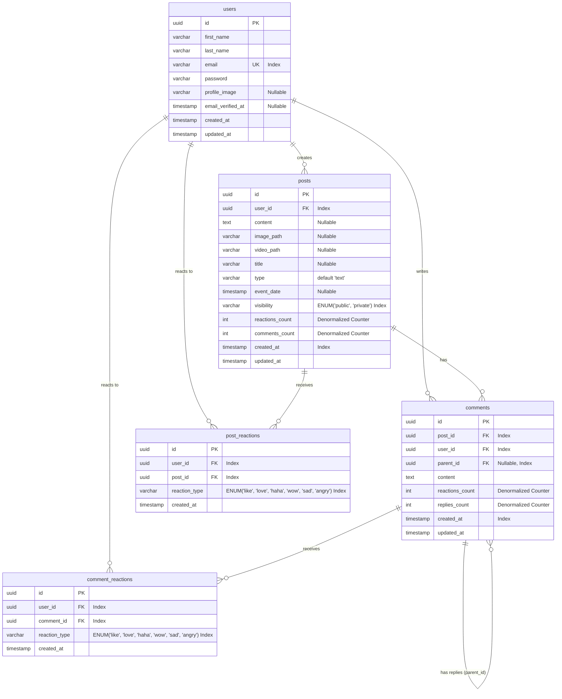

# Database Data Model and Entity Relationship Diagram (ERD)

This document outlines the database design, Entity Relationship Diagram (ERD), indexing strategies, and architectural considerations to support a highly performant and secure social feed application scaling to millions of users, posts, and reads.

---

## 1. Entity Relationship Diagram (ERD)

Below is the database ERD modeled using Mermaid. It features explicit tables for reactions (such as like, love, haha) with native foreign keys and uses UUIDs for all primary and foreign key relations.



---

## 2. Table Schemas & Data Model

### `users` Table
Stores user registration details and credentials.

| Column | Type | Attributes | Description |
| :--- | :--- | :--- | :--- |
| `id` | `UUID` | Primary Key | Unique identifier (generated via UUID v4). |
| `first_name` | `VARCHAR(255)` | Not Null | User's first name. |
| `last_name` | `VARCHAR(255)` | Not Null | User's last name. |
| `email` | `VARCHAR(255)` | Unique, Not Null | Email address (used for login). |
| `password` | `VARCHAR(255)` | Not Null | Hashed password (e.g., bcrypt/argon2). |
| `profile_image` | `VARCHAR(255)` | Nullable | URL/path to the uploaded profile image. |
| `email_verified_at`| `TIMESTAMP` | Nullable | Email verification timestamp. |
| `created_at` | `TIMESTAMP` | Default CURRENT_TIMESTAMP| Record creation time. |
| `updated_at` | `TIMESTAMP` | Default CURRENT_TIMESTAMP| Record update time. |

* **Indexes**:
  * Primary Key on `id`
  * Unique Index on `email`

---

### `posts` Table
Stores user-generated posts. Supports text, images, videos, events, and article post formats.

| Column | Type | Attributes | Description |
| :--- | :--- | :--- | :--- |
| `id` | `UUID` | Primary Key | Unique identifier (generated via UUID v4). |
| `user_id` | `UUID` | Foreign Key (users.id), Not Null | Author of the post. |
| `content` | `TEXT` | Nullable | The text content of the post. |
| `image_path` | `VARCHAR(255)` | Nullable | URL/path to the uploaded image in storage. |
| `video_path` | `VARCHAR(255)` | Nullable | URL/path to the uploaded video in storage. |
| `title` | `VARCHAR(255)` | Nullable | Optional title for event/article post formats. |
| `type` | `VARCHAR(20)` | Default 'text', Not Null | `'text'`, `'photo'`, `'video'`, `'event'`, or `'article'`. |
| `event_date` | `TIMESTAMP` | Nullable | Scheduled datetime (only for `'event'` post type). |
| `visibility` | `VARCHAR(20)` | Default 'public', Not Null | `'public'` (visible to all) or `'private'` (author only). |
| `reactions_count` | `INT` | Default 0, Not Null | Denormalized count of all reactions combined to avoid expensive reads. |
| `comments_count`| `INT` | Default 0, Not Null | Denormalized count of top-level comments + replies. |
| `created_at` | `TIMESTAMP` | Default CURRENT_TIMESTAMP| Feed ordering basis. |
| `updated_at` | `TIMESTAMP` | Default CURRENT_TIMESTAMP| Record update time. |

* **Indexes & Optimization**:
  * Primary Key on `id`
  * Composite Index: `(visibility, created_at DESC)` for fetching the global public feed fast.
  * Composite Index: `(user_id, created_at DESC)` for fetching user profile feeds fast.
  * Composite Index: `(user_id, visibility, created_at DESC)` for profile feeds viewed by other users.

---

### `comments` Table
Stores comments and nested replies. Uses the **Adjacency List Pattern** with `parent_id`.

| Column | Type | Attributes | Description |
| :--- | :--- | :--- | :--- |
| `id` | `UUID` | Primary Key | Unique identifier (generated via UUID v4). |
| `post_id` | `UUID` | Foreign Key (posts.id), Not Null | The root post this comment/reply belongs to. |
| `user_id` | `UUID` | Foreign Key (users.id), Not Null | The author of the comment/reply. |
| `parent_id` | `UUID` | Foreign Key (comments.id), Nullable| Reference to parent comment if it is a reply. |
| `content` | `TEXT` | Not Null | The message text. |
| `reactions_count` | `INT` | Default 0, Not Null | Denormalized count of all reactions combined. |
| `replies_count` | `INT` | Default 0, Not Null | Denormalized replies counter. |
| `created_at` | `TIMESTAMP` | Default CURRENT_TIMESTAMP| Ordering of comments/replies. |
| `updated_at` | `TIMESTAMP` | Default CURRENT_TIMESTAMP| Record update time. |

* **Key Design Decisions**:
  * **`post_id` is always populated**, even for deeply nested replies. This allows pulling or counting all comments for a post in a single flat query without recursion.
  * `parent_id` is `NULL` for top-level comments and contains the parent comment ID for replies.
* **Indexes**:
  * Primary Key on `id`
  * Composite Index: `(post_id, parent_id, created_at ASC)` to load comments and replies sequentially for a post.
  * Index on `user_id` (foreign key constraint lookup index).
  * Index on `parent_id` (foreign key constraint lookup index).

---

### `post_reactions` Table
Stores user reactions (like, love, haha, etc.) for posts.

| Column | Type | Attributes | Description |
| :--- | :--- | :--- | :--- |
| `id` | `UUID` | Primary Key | Unique identifier (generated via UUID v4). |
| `user_id` | `UUID` | Foreign Key (users.id), Not Null | User who reacted to the post. |
| `post_id` | `UUID` | Foreign Key (posts.id), Not Null | Post that was reacted to. |
| `reaction_type` | `VARCHAR(20)` | Not Null | `'like'`, `'love'`, `'haha'`, `'wow'`, `'sad'`, or `'angry'`. |
| `created_at` | `TIMESTAMP` | Default CURRENT_TIMESTAMP| Timestamp of the action. |

* **Indexes & Optimization**:
  * Composite Unique Index: `(user_id, post_id)` - **CRITICAL** to ensure a user can only have one active reaction per post. If they change their reaction (e.g. from `like` to `love`), the existing row is updated.
  * Composite Lookup Index: `(post_id, created_at DESC)` - Used to display the list of users who reacted to the post.
  * Index on `(post_id, reaction_type, created_at DESC)` - Enables quick aggregation of reaction type breakdowns.

---

### `comment_reactions` Table
Stores user reactions (like, love, haha, etc.) for comments and replies.

| Column | Type | Attributes | Description |
| :--- | :--- | :--- | :--- |
| `id` | `UUID` | Primary Key | Unique identifier (generated via UUID v4). |
| `user_id` | `UUID` | Foreign Key (users.id), Not Null | User who reacted to the comment. |
| `comment_id` | `UUID` | Foreign Key (comments.id), Not Null | Comment or reply that was reacted to. |
| `reaction_type` | `VARCHAR(20)` | Not Null | `'like'`, `'love'`, `'haha'`, `'wow'`, `'sad'`, or `'angry'`. |
| `created_at` | `TIMESTAMP` | Default CURRENT_TIMESTAMP| Timestamp of the action. |

* **Indexes & Optimization**:
  * Composite Unique Index: `(user_id, comment_id)` - Ensures a user can only have one active reaction per comment/reply.
  * Composite Lookup Index: `(comment_id, created_at DESC)` - Used to display the list of users who reacted to the comment/reply.

---

## 3. High-Scale Optimization Strategies

Designing for **millions of posts and reads** requires shifting from purely normalized database queries to optimization, denormalization, and caching strategies.

### 1. Counter Denormalization
* **The Problem**: Executing `SELECT COUNT(*) FROM post_reactions WHERE post_id = ?` on every feed render will lock and slow down the database at scale.
* **The Solution**: Maintain `reactions_count` and `comments_count` directly in the `posts` and `comments` tables. 
* **Implementation**: Increment/decrement these values using transactional atomic queries (e.g., `DB::raw('reactions_count + 1')`) whenever a reaction is added/removed.

### 2. Composite Query Indexing
* **Feed Retrieval**: The primary query fetches the latest public posts:
  ```sql
  SELECT * FROM posts 
  WHERE visibility = 'public' 
  ORDER BY created_at DESC 
  LIMIT 20;
  ```
  An index on `(visibility, created_at DESC)` allows the engine to fetch the latest 20 posts in `O(log N)` without scanning millions of rows or executing a costly filesort.
* **Profile Feed Retrieval**: Fetching a specific user's posts sorted by date uses the composite index `(user_id, created_at DESC)` or `(user_id, visibility, created_at DESC)`.

### 3. Quick "Has Reacted" Check
* When rendering a feed page of 20 posts, we must show whether the current user reacted to each post and what reaction type they used.
* **The Optimization**: Instead of running 20 individual queries, fetch all active reactions for the current user in a single batch query:
  ```sql
  SELECT post_id, reaction_type FROM post_reactions 
  WHERE user_id = :current_user_id 
    AND post_id IN (:post_ids);
  ```
  This is backed by the composite unique index `(user_id, post_id)` and returns instantly.

### 4. Fetching the List of Reacted Users
* **The Requirement**: Users want to see a list of who has reacted to a specific post or comment (ordered by the most recent reaction, optionally filtered by reaction type).
* **The Queries**:
  * **For a Post (All Reactions)**:
    ```sql
    SELECT u.id, u.first_name, u.last_name, u.email, pr.reaction_type 
    FROM post_reactions pr
    JOIN users u ON pr.user_id = u.id
    WHERE pr.post_id = :post_id
    ORDER BY pr.created_at DESC
    LIMIT 20 OFFSET :offset;
    ```
  * **For a Post (Filtered by Reaction Type, e.g. "love")**:
    ```sql
    SELECT u.id, u.first_name, u.last_name, u.email, pr.reaction_type 
    FROM post_reactions pr
    JOIN users u ON pr.user_id = u.id
    WHERE pr.post_id = :post_id AND pr.reaction_type = :reaction_type
    ORDER BY pr.created_at DESC
    LIMIT 20 OFFSET :offset;
    ```
* **The Optimization**: These queries use the composite lookup indexes `(post_id, created_at DESC)` and `(post_id, reaction_type, created_at DESC)` on the reaction tables. The database engine can locate the exact rows directly, join them with the primary key index on the `users` table (`O(1)` per user), and paginate the results without performing any full-table scans.

### 5. Read Replicas & Database Sharding
* **Primary/Replica Setup**: Reads typically outnumber writes in social feeds by 10:1 or 100:1. Setup read replicas to distribute reading workloads.
* **Sharding (conceptual future-proofing)**: If the dataset grows to hundreds of millions, shard the tables horizontally by hash of user IDs or post IDs, ensuring related data is colocated on specific nodes.

### 6. Caching Layer (Redis)
* **Feed Cache**: Cache the global public feed (e.g., first 50-100 posts) in Redis. Active reads fetch directly from memory.
* **User Session Cache**: Authenticated user session state (or JWT validation cache) can be stored in Redis to minimize hitting the database during token verification.
